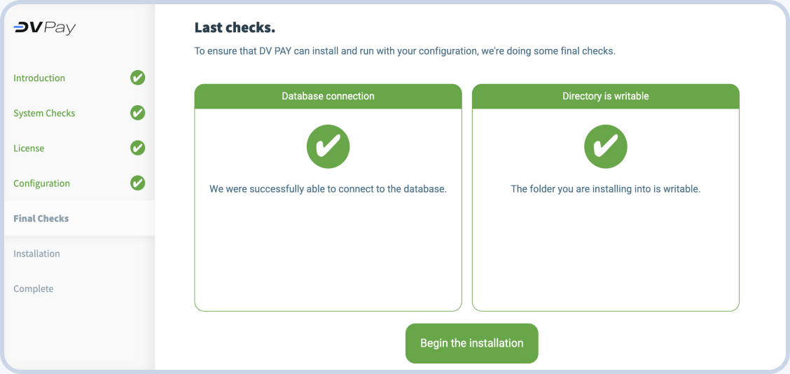

# Install

You can install DV PAY in several ways

- [Install from shell script](./INSTALLATION.html#install-from-shell-script)
- [Web Install](./INSTALLATION.html#install-from-shell-script)

## Prepairing for installation

For successful installation you will need 3 domains:

- **Frontend domain.** Domain on which the personal account user interface will be deployed;
- **Backend domain.** Domain where the backend will be located;
- **Payment domain.** The domain where the payment form for your clients will be located;
- **Processing URL** contact [DV Support](https://t.me/dv_pay_bot) to get it.

> For example, if your main site is on the `mybestshop.com` domain, then you can create the following additional
> domains:
>- `app.mybestshop.com` (frontend)
>- `api.mybestshop.com` (backend)
>- `pay.mybestshop.com` (payment)

Prepare a virtual machine with CentOS. All necessary update packages will be installed automatically during script
execution.

## Install from shell script

### Step 1. Launch

To successfully install the required application on your server, you'll need a server running the CentOS operating
system. Please ensure that your server meets these requirements.

To initiate the application installation, execute the following command in your server terminal:

``` shell
bash <(curl -Ls https://raw.githubusercontent.com/dvpay/dv-backend/master/init.sh)
```

This command will download and automatically run the installation script from the specified repository link. Ensure that
your server has internet access for the process to complete successfully.

Make sure to verify the validity of the repository link to ensure you are using the latest version of the installation
script.

If you encounter any questions or issues during the installation process, feel free to reach out for
support. [DV Support](https://t.me/dv_pay_support)

### Step 2. Input domains

Enter your domains, which you got during [preparation](#prepairing-for-installation)


### Step 3. Enter processing URL

If you are going to use your own payments processing - enter IP or URL here. If not -
ask [DV Support](https://t.me/dv_pay_support) to use ours ablosutely free!


After entering processing URL script will continue installation. In the end of script you will be provided with **DV
Credentials - copy it to a safe place.**

## Web installation

To install the product you will need a server with a Linux operating system, we recommend using the centos distribution
and you need to install the following software:

- Nginx
- php 8.1^ and php extension
  cli,fpm,mysqlnd,pdo_mysql,zip,devel,gd,mbstring,curl,xml,pear,bcmath,json,pecl-redis5,exif,pcntl,sockets,gmp
- composer
- redis
- Database mysql percona and database need make with collation utf8mb4_unicode_ci
- node 18^ and npm
- global installed vite package for install ``` npm install -g vite```

### Recommendations

Create a new user in you server for example:

```shell
adduser server && usermod -aG wheel server
```

### Step 1. Download and extract Web Installer

Create a new directory and upload the archive with the installer into it. For example, in /home/server/merchant:

```shell
mkdir -p /home/server/merchant && cd /home/server/merchant
```

```shell
wget https://github.com/stickpro/web-installer/releases/download/v1.0.1/install.tar.gz && tar -xzvf install.tar.gz
```

### Step 2. Grant rights to the directory

Give the created user rights to the directory, where the installer is downloaded and unpacked:

```shell
chmod 755 /home/server && chown server:server -R /home/server/merchant
```

### Step 3. Add nginx configuration

In the `etc/nginx/conf.d` directory, create a configuration file with the extension `.conf`, give it a convenient name:

```shell
touch mydomain.com.conf
```

Fill the configuration file with the following code, substituting your domain (line 4) and path to php.sock (lines 30,
45 и 51):

```shell
server {

    listen 80;
    server_name mydomain.com;

    add_header 'Access-Control-Allow-Headers' '*' always;
    add_header 'Access-Control-Allow-Origin' '*' always;

    access_log  /var/log/nginx/merchant.access.log;
    error_log   /var/log/nginx/merchant.error.log;

    root        /home/server/merchant;
    index       index.php, index.html;

    location /install {
        root /home/server/merchant;
        try_files $uri $uri/ /index.html?$args;
    }

    location / {
       root /home/server/merchant/frontend;
       try_files $uri $uri/ /index.html?$args;
    }

    location ^~ /api {
        alias /home/server/merchant/public;
        try_files $uri $uri/ @api;

        location ~ .php {
            fastcgi_pass unix:/var/run/php82.sock;
            fastcgi_split_path_info ^(.+.php)(.*)$;
            include fastcgi.conf;
            fastcgi_param SCRIPT_FILENAME /home/server/merchant/public/index.php;
        }
    }

    location @api {
        rewrite /api/(.*)$ /api/index.php?/$1 last;
    }

    location ~ api.php$ {
        include fastcgi.conf;
        fastcgi_param PHP_VALUE "max_execution_time = 900";
        fastcgi_param PHP_VALUE "max_input_time = 900";
        fastcgi_pass unix:/var/run/php82.sock;
        fastcgi_read_timeout 900;
    }

    location ~ .php$ {
        include fastcgi.conf;
        fastcgi_pass unix:/var/run/php82.sock;
    }

    location ~ /.(ht|svn|git) {
            deny all;
    }

}
```

### Step 4. Running the installer

Now you are ready to run the installer - it will check matches the installed packages and will ask for the necessary
information. Open your browser and go to link mydomain.com/install.html

#### 1.Enter domain


#### 2.Connecting the database

Enter the credentials for connect to you database.


#### 3.Set the login and password for admin

Enter the email address that will be be used as a login, and also set password for the account.


#### 4.Complete installation

After checking access to the database, the installation will begin. Once the installation is complete, click the “go to
website” button to go to your DV Pay personal account. Log in using the username and password that asked in the last
step. 



### Step 5. Setting up queues and cron

Launch cron editor:

```shell
 crontab -e
```

Add a regular launch setting:

```shell
* * * * * cd /path-to-your-project && /usr/bin/php artisan schedule:run >> /dev/null 2>&1
```

::: warning Path
Change /path-to-your-project to actual path to you directory with application
and actual path to you /usr/bin/php 
:::

#### Setting up systemd configuration

Go to directory /etc/systemd/system/ and create 2 configuration files: 

```shell
cd /etc/systemd/system
touch transfers.service queue@.service
```

Add configuration code to each file:

For the transfers.service file:

```shell
[Unit]
Description=Transfer to Processing
After=network.target

[Service]
Type=simple
User=server

WorkingDirectory=/home/server
ExecStart=/usr/bin/php /home/server/backend/artisan withdrawal:loop

Restart=on-failure
RestartSec=3
StandardOutput=syslog
StandardError=syslog
SyslogIdentifier=transfers

[Install]
WantedBy=multi-user.target
```
For the file queue@.service:
```shell
[Unit]
Description=Queue Worker %I
After=network.target

[Service]
User=server
Group=server
ExecStart=/usr/bin/php /home/server/backend/artisan queue:work --queue=default,notifications,monitor --sleep=3 --tries=3 --max-time=3600
Restart=on-failure

[Install]
WantedBy=multi-user.target
```
Run the systemd demon

```shell
systemctl enable transfers.service
systemctl enable queue@.service

systemctl start transfers.service
systemctl start queue@.service
```
