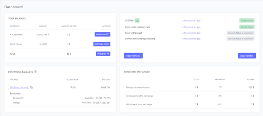
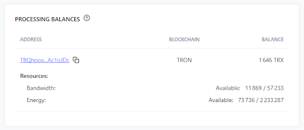
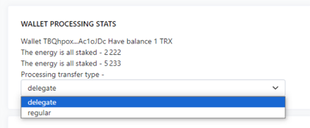
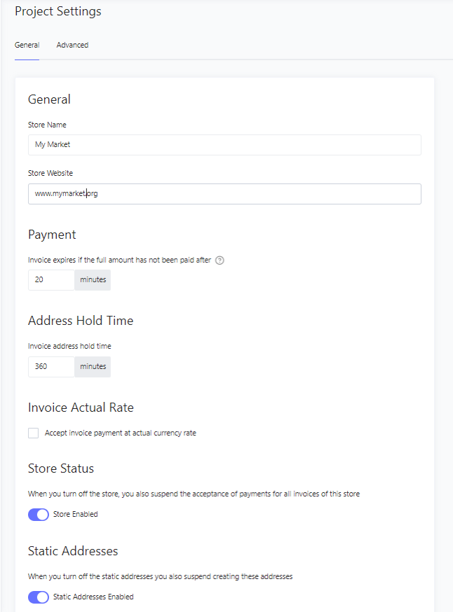
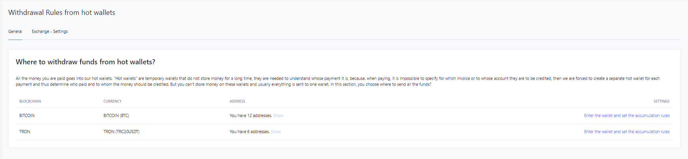

# How to use my Account

#### Desktop.

This is a space that contains General and summary information about your account.

Here you can track:
- The total balance of Hot wallets in BTC/TRON;
- System monitoring and error detection;
- Processing balance and current amount of resources;
- Savings and Exchange when combusting Energy and Bandwidth;
- Summary of Deposits by day;
- Replenishment transactions on Hot Wallets.

To withdraw resources most efficiently, it is advisory to use a ‘Stake’ method.  
At the moment, the relevant method is Stake 2.0

In this scenario, the Store owner will significantly save on fees for transferring tokens from Hot Wallets to Personal Wallets/Exchange Wallets.  
Using the Stake method, the user accumulates Energy and Bandwidth daily by “freezing” their TRX. Thanks to this, it will be possible to burn Energy and save on commission when transferring amounts from a wallet to a wallet.  
We recommend using TronLink for Staking.

#### Processing balances.

You can use both our Processing wallet and your own, which we will connect to your account.  
To do this, the best solution is to contact your personal manager or Support team.  
We will transfer: A wallet, a Mnemonic phrase and you will be able to use TronLink to “freeze" TRX.

Several methods are used to withdraw funds from a Hot Wallet to Personal Wallets/Exchange Wallets:

- ‘Delegate’ is a method in which a certain amount of TRX has been ‘staked’, and the Energy and Bandwidth received are spent on paying commissions for the transfers from a Hot Wallet to your withdrawal wallet (this can be your Cold Wallet or an Exchange Wallet)

- ‘Regular’ is a method in which you will need to burn TRX to pay commissions.

#### Your Projects.

In this section, you can create Stores, monitor the number of payments, their amount and change the settings for each of them.

In the “Settings” section the following Editing is available to you:

- Invoice expiration date;
- Freezing time for the invoice address;
- Current exchange rate activation;
- Store's Status Editing;
- The ability to use Permanent addresses for payments.

In the Advanced Settings you can configure Api keys, manage Webhook and the ability to use the return URL when making an invoice payment.

#### Hot Wallets.

To pay for services, a separate Hot Wallet is created on your Merchant for each user. It is located in the Hot Wallets tab:  
You will be able to view the transaction history for each wallet that has been used for the payment.

To activate Hot Wallets, you must have at least 1 TRX on your balance, so the best solution would be to keep some amount in the account of the Processing Wallet for their activation.

#### Withdrawal Rules.
This section is used to withdraw funds from Hot Wallets to your Cold Wallet, or to an Exchange Account.

In the Withdrawal Rules section, you can specify your wallets to which all funds received will be transferred. There is an option to choose the method of funds transfer Inside each wallet in  BTC/TRON systems.  
They are:
- Withdraw as soon as the funds are received;
- Withdraw manually;
- Withdraw upon the accumulation of certain amounts;
- Withdraw according to the schedule.

 To withdraw funds from Hot Wallets to your Cold Wallet or an Exchange Account, it is necessary to complete the following steps:
1. Top up the TRX Processing Wallet and stake them to get Energy and Bandwidth (for more information, see the Desktop section)
2. Select the method of transactions: Delegate/Regular (for more information, see the Processing wallet section)
3. Specify BTC/TRON wallets and the funds withdrawal method (for more information, see the Withdrawal Rules section)

After completing the steps described above, you should not have any questions about the funds withdrawal.

