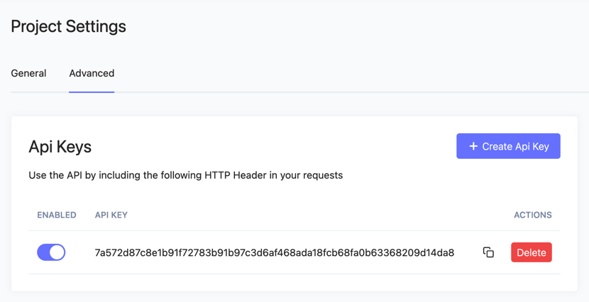

## Preparation before and integration

Before you start using the API, you need to create a store in the merchant’s account and receive an API token



This token must be set for all requests in x-api-key headers

The X-Api-Key that we created is needed to authenticate the store in the merchant

## Endpoints

### Creating addresses for the payer

If the payer has not yet been created then we will create it, if it has already been created then we will take the
existing one and also return the payment addresses for all blockchains. We highly recommend using this method for simple
integration and constant receipt of addresses

`[POST] /payer/addresses`

body request json

```json
{
  "storeUserId": "string",
  "email": "string",
  "ip": "string"
}
```

response example

```

  "result": [
    {
      "blockchain": "bitcoin",
      "currency": "BTC.Bitcoin",
      "address": "bc1qwzefc7fp8tdlnv0es3pk6snad22hhet528d50e86",
      "rate": "26568.16995000",
      "payer": {
        "id": "de95717c-9814-4887-ba6b-94fc31eb6973",
        "storeUserId": "1232143",
        "payerUrl": "https://dv.net/invoices/payer/de95717c-9814-4887-ba6b-94fc31eb6973"
      }
    },
    {
      "blockchain": "tron",
      "currency": "USDT.Tron",
      "address": "TKn5GuNb62KgQh7SLXznUrP33Nae28d50e86",
      "rate": "1",
      "payer": {
        "id": "de95717c-9814-4887-ba6b-94fc31eb6973",
        "storeUserId": "1232143",
        "payerUrl": "https://dv.net/invoices/payer/de95717c-9814-4887-ba6b-94fc31eb6973"
      }
    }
  ],
  "errors": []
}
```

### Create payer

Creating a payer, if a user with such an identifier is created, then data from the database will be returned

`[POST] /payer/create/`

body request json

```json
{
  storeUserId: "string"
}
```

storeUserId unique identifier of the payer in the store

response example

```json
{
  "result": {
    "id": "9ff39a38-71e1-4a27-83f6-65312691e28e",
    "store_id": "9fe169fc-638c-4387-8477-8bf0e9268248",
    "store_user_id": "1",
    "payerUrl": "https://dv.net/invoices/payer/9ff39a38-71e1-4a27-83f6-65312691e28e",
    "store": {
      "id": "9fe169fc-638c-4387-8477-8bf0e9268248",
      "name": "3321",
      "status": 1,
      "staticAddress": 1,
      "storeCurrencyCode": "USD"
    },
    "address": [
      {
        "blockchain": "bitcoin",
        "currency": "BTC.Bitcoin",
        "address": "bc1qwzefc7fp8tdlnv0es3pk6snad22hhet56c300461",
        "payer": {
          "id": "9ff39a38-71e1-4a27-83f6-65312691e28e",
          "storeUserId": "1",
          "payerUrl": "https://dv.net/invoices/payer/9ff39a38-71e1-4a27-83f6-65312691e28e"
        }
      }
    ]
  },
  "errors": []
}
```

It is worth noting that the address field will be empty if we have just created a payer

### Request the payer addresses for a specific currency

Perhaps you do not want to accept payments only in a specific currency, then this endpoint will be useful to you

`[GET]/address/{payer}/{currency}`

Where payer is the id of the payer that was received when creating the corresponding request, currency currency
BTC.Bitcoin, USDT.tron example request

`[GET]/address/9ff39a38-71e1-4a27-83f6-65312691e28e/BTC.Bitcoin`

response example

```
{
  "result": {
    "blockchain": "bitcoin",
    "currency": "BTC.Bitcoin",
    "address": "bc1qwzefc7fp8tdlnv0es3pk6snad22hhet56c300461",
    "payer": {
      "id": "9ff39a38-71e1-4a27-83f6-65312691e28e",
      "storeUserId": "1"
    }
  },
  "errors": []
}
```

### Request the store currency rate

`[GET] /v2/stores/currencies/rate`

Currency is passed in the query parameter

request example 

`[GET] /v2/stores/currencies/rate?currency=BTC.Bitcoin`

response example


```json
{
  "result": {
    "rateSource": "Binance",
    "rate": "1714.99000000",
    "lastUpdate": {
      "date": "2023-08-31 11:55:57.062434",
      "timezone_type": 3,
      "timezone": "UTC"
    }
  },
  "errors": []
}
```
