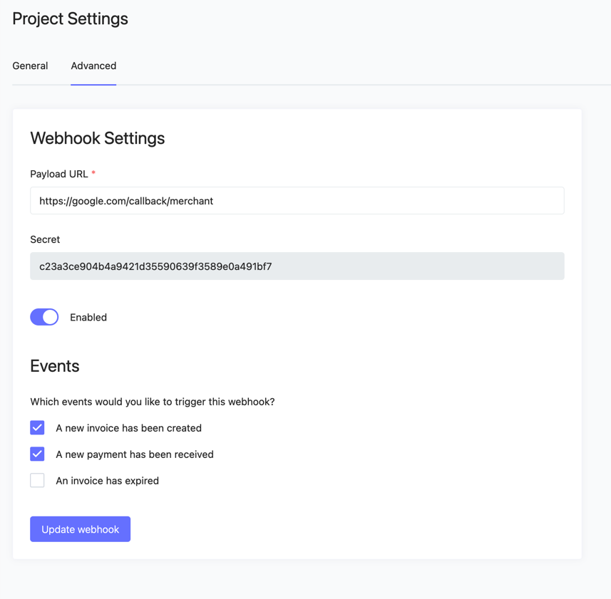

# Web Hook

To notify the store when a payment has been received, we use a web hook mechanism.
To receive information about payments in your store, register the endpoint to which you want to receive notifications
about payments in the merchant’s store settings



Where the secret is used for signing

Be sure to check the box next to A new payment has been received

Receiving a callback in order to find out about a payment, you need to create an endpoint on the integrator side to
which the merchant will send an event at the given moment. The merchant supports only one event option: receiving a
payment

To secure the store, a signature mechanism is used. The merchant transmits a hashed sha256 string in the X-sign header,
which includes the body of the request being sent and the concatenated secret

For example, a merchant sends a web hook to the url `https://mystore.com/callback/merchant` with a POST request

The request body in this case will be like this

```Json
{
  "orderId": "",
  "status": "paid",
  "createdAt": "2023-09-15T07:31:46.000000Z",
  "paidAt": "2023-09-15T07:31:46.000000Z",
  "expiredAt": "2023-09-15T07:51:46.000000Z",
  "amount": 15,
  "receivedAmount": "15.00",
  "transactions": [
    {
      "txId": "98af9289aa06da5a13a9881dd2ee74ba85cfd1af20343ce50c6071275eea8e7b",
      "createdAt": "2023-09-15 07:31:46",
      "currency": "USDT",
      "blockchain": "tron",
      "amount": "15.00000000",
      "amountUsd": "15.00",
      "rate": "1.00000000"
    }
  ],
  "payer": {
    "id": "623cf62d-7ec3-4b60-8abc-ba063f3bbf93",
    "storeUserId": "502162"
  }
}
```

our X-sign header will be eaba3d825829da2db79b95ef362e7b24a4c8b27fb643bad54d180e43ca9152de

Accordingly, on the store side it is worth checking the validity of the signature by creating the same hash and checking
it with the header

```php
$requestBodyString = '{"orderId":"","status":"paid","createdAt":"2023-09-15T07:31:46.000000Z","paidAt":"2023-09-15T07:31:46.000000Z","expiredAt":"2023-09-15T07:51:46.000000Z","amount":15,"receivedAmount":"15.00","transactions":[{"txId":"98af9289aa06da5a13a9881dd2ee74ba85cfd1af20343ce50c6071275eea8e7b","createdAt":"2023-09-15 07:31:46","currency":"USDT","blockchain":"tron","amount":"15.00000000","amountUsd":"15.00","rate"
:"1.00000000"}],"payer":{"id":"623cf62d-7ec3-4b60-8abc-ba063f3bbf93","storeUserId":"502162"}}';

$secret = 'c23a3ce904b4a9421d35590639f3589e0a491bf7'

$sign = hash('sha256', $requestBodyString . $secret); //eaba3d825829da2db79b95ef362e7b24a4c8b27fb643bad54d180e43ca9152de
```

if for some reason it was not possible to receive a 200 response from the store, after some time the merchant will send the message again, the frequency of sending increases exponentially
