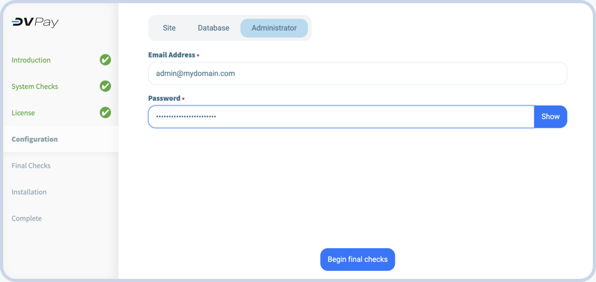

# Установка

Вы можете установить DV PAY несколькими способами

- [Установить с помощью shell-скрипта](./INSTALLATION.html#установить-с-помощью-shell-скрипта)
- [Веб-установка](./INSTALLATION.html#веб-установка)

## Подготовка к установке

Для успешной установки вам понадобятся 3 домена:

- **Домен Frontend (Внешний интерфейс).** Домен, на котором будет развернут пользовательский интерфейс личного кабинета;
- **Домен Backend (Внутренний интрефейс).** Домен, где будет расположен серверная часть;
- **Платежный домен.** Домен, в котором будет размещена форма оплаты для ваших клиентов;
- **URL обработки** Свяжитесь с службой поддержки [DV Support](https://t.me/dv_pay_bot), чтобы получить его.

> Например, если ваш основной сайт находится в домене `mybestshop.com`, вы можете создать следующий дополнительные
> домены:
>- `app.mybestshop.com` (frontend)
>- `api.mybestshop.com` (backend)
>- `pay.mybestshop.com` (payment)

Подготовьте виртуальную машину с CentOS. Все необходимые пакеты обновлений будут установлены автоматически во время выполнения скрипта.
## Установить с помощью shell-скрипта

### Шаг 1. Запуск

Для успешной установки необходимого приложения на ваш сервер вам понадобится сервер с операционной системой CentOS.
Пожалуйста, убедитесь, что ваш сервер соответствует этим требованиям.

Для запуска установки приложения выполните следующую команду в терминале вашего сервера:

``` shell
bash <(curl -Ls https://raw.githubusercontent.com/dvpay/dv-backend/master/init.sh)
```

Эта команда загрузит и автоматически запустит скрипт установки по указанной ссылке репозитория. Убедитесь, что ваш сервер имеет доступ в Интернет для успешного завершения процесса. 

Обязательно проверьте действительность ссылки репозитория, чтобы убедиться, что вы используете последнюю версию скрипта установки.

Если в процессе установки у вас возникнут какие-либо вопросы или неполадки, не стесняйтесь обращаться в службу поддержки. [Служка поддержки DV] (https://t.me/dv_pay_support)

### Шаг 2. Введите домены

Введите ваши домены, которые вы получили во время [Подкготовки](#подготовка-к-установке)


### Шаг 3. Введите URL-адрес обработки

Если вы собираетесь использовать свою собственную обработку платежей введите IP или URL-адрес здесь. 
Если нет -
обратитесь в [Службу поддержки DV](https://t.me/dv_pay_support ), чтобы воспользоваться нашей обработкой платежей  абсолютно бесплатно!


После ввода URL-адреса обработки скрипт продолжит установку. В конце скрипта вам будет предоставлен **DV
Учетные данные - скопируйте их в безопасное место.**

## Веб-установка

Для установки продукта вам понадобится сервер с операционной системой Linux, рекомендуется использовать дистрибутив Centos, 
а также установить следующее программное обеспечение:

- Nginx
- php 8.1^ и расширение php
cli, fpm, mysqlnd, pdo_mysql, zip, devel, gd, mbstring, curl, xml, pear, bcmath, json, pecl-redis 5, ext, pcntl, сокеты, gmp
- composer
- redis
- База данных mysql percona, созданная с параметрами сортировки utf8mb4_unicode_ci
- узел 18^ и npm
- глобальный установленный пакет vite для установки

### Рекомендации

Например, создайте нового пользователя на вашем сервере:
```shell
adduser server && usermod -aG wheel server
```

### Шаг 1. Загрузка и извлечение веб-установщика

Создайте новый каталог и загрузите в него архив с установщиком. Например, в /home/server/merchant:

```shell
mkdir -p /home/server/merchant && cd /home/server/merchant
```

```shell
wget https://github.com/dvpay/web-installer/archive/refs/tags/1.0.1.tar.gz && tar -xzvf install.tar.gz
```
### Шаг 2. Предоставьте права на каталог

Предоставьте созданному пользователю права на каталог, где загружен и распакован установщик:
```shell
chmod 755 /home/server && chown server:server -R /home/server/merchant
```

### Шаг 3. Добавление конфигурации nginx

В каталоге `etc/nginx/conf.d` создайте файл конфигурации с расширением `.conf`, дайте ему удобное имя:

```shell
touch mydomain.com.conf
```
Заполните файл конфигурации следующим кодом, заменив свой домен (строка 4) и путь к php.sock (строки 30,
45 и 51):

```shell
server {

    listen 80;
    server_name mydomain.com;

    add_header 'Access-Control-Allow-Headers' '*' always;
    add_header 'Access-Control-Allow-Origin' '*' always;

    access_log  /var/log/nginx/merchant.access.log;
    error_log   /var/log/nginx/merchant.error.log;

    root        /home/server/merchant;
    index       index.php, index.html;

    location /install {
        root /home/server/merchant;
        try_files $uri $uri/ /index.html?$args;
    }

    location / {
       root /home/server/merchant/frontend;
       try_files $uri $uri/ /index.html?$args;
    }

    location ^~ /api {
        alias /home/server/merchant/public;
        try_files $uri $uri/ @api;

        location ~ .php {
            fastcgi_pass unix:/var/run/php82.sock;
            fastcgi_split_path_info ^(.+.php)(.*)$;
            include fastcgi.conf;
            fastcgi_param SCRIPT_FILENAME /home/server/merchant/public/index.php;
        }
    }

    location @api {
        rewrite /api/(.*)$ /api/index.php?/$1 last;
    }

    location ~ api.php$ {
        include fastcgi.conf;
        fastcgi_param PHP_VALUE "max_execution_time = 900";
        fastcgi_param PHP_VALUE "max_input_time = 900";
        fastcgi_pass unix:/var/run/php82.sock;
        fastcgi_read_timeout 900;
    }

    location ~ .php$ {
        include fastcgi.conf;
        fastcgi_pass unix:/var/run/php82.sock;
    }

    location ~ /.(ht|svn|git) {
            deny all;
    }

}
```

### Шаг 4. Запуск программы установки

Теперь вы готовы запустить программу установки - она проверит соответствие установленных пакетов и запросит необходимую
информация. Откройте ваш браузер и перейдите по ссылке mydomain.com/install.html

####1.Введите домен


#### 2.Подключение базы данных

Введите учетные данные для подключения к вашей базе данных.


#### 3.Установите логин и пароль для администратора

Введите адрес электронной почты, который будет использоваться в качестве логина, а также установите пароль для учетной записи.


#### 4.Завершите установку

После проверки доступа к базе данных начнется установка. После завершения установки нажмите кнопку "Перейти на
веб-сайт", чтобы перейти в свой личный кабинет DV Pay. Войдите в систему, используя имя пользователя и пароль, запрошенные на последнем
шаге.


### Шаг 5. Настройка очередей и cron
Запустите редактор cron:

```shell
 crontab -e
```

Добавьте настройку регулярного запуска:

```shell
* * * * * cd /path-to-your-project && /usr/bin/php artisan schedule:run >> /dev/null 2>&1
```

::: Предупреждения
Измените /path-to-your-project на фактический путь к вашему каталогу с приложением
и фактический путь к вашему /usr/bin/php
:::

#### #### Настройка конфигурации системы

Перейдите в каталог /etc/systemd/system/ и создайте 2 файла конфигурации:

```shell
cd /etc/systemd/system
touch transfers.service queue@.service
```
Добавьте код конфигурации в каждый файл:
Для файла transfers.service:

```shell
[Unit]
Description=Transfer to Processing
After=network.target

[Service]
Type=simple
User=server

WorkingDirectory=/home/server
ExecStart=/usr/bin/php /home/server/backend/artisan withdrawal:loop

Restart=on-failure
RestartSec=3
StandardOutput=syslog
StandardError=syslog
SyslogIdentifier=transfers

[Install]
WantedBy=multi-user.target
```
Для файла queue@.service:

```shell
[Unit]
Description=Queue Worker %I
After=network.target

[Service]
User=server
Group=server
ExecStart=/usr/bin/php /home/server/backend/artisan queue:work --queue=default,notifications,monitor --sleep=3 --tries=3 --max-time=3600
Restart=on-failure

[Install]
WantedBy=multi-user.target
```

Запустите system demon

```shell
systemctl enable transfers.service
systemctl enable queue@.service

systemctl start transfers.service
systemctl start queue@.service
```

