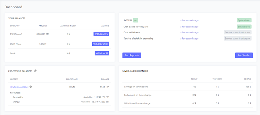
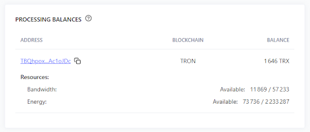
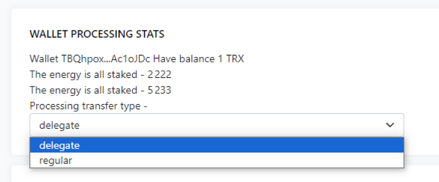
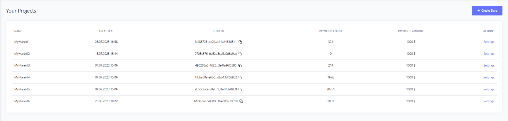
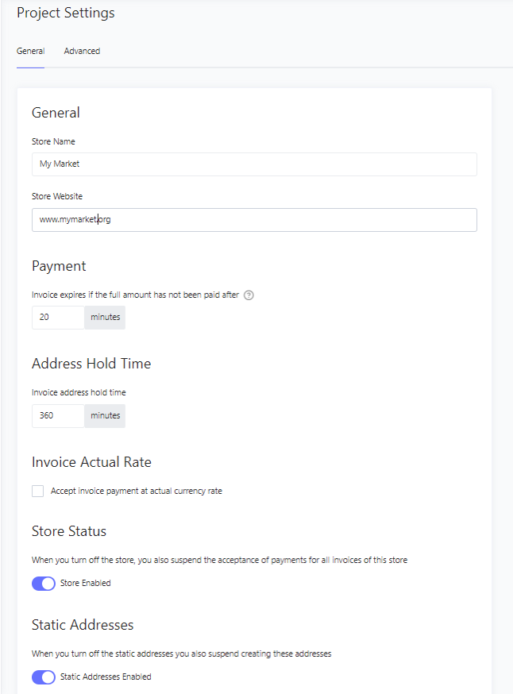
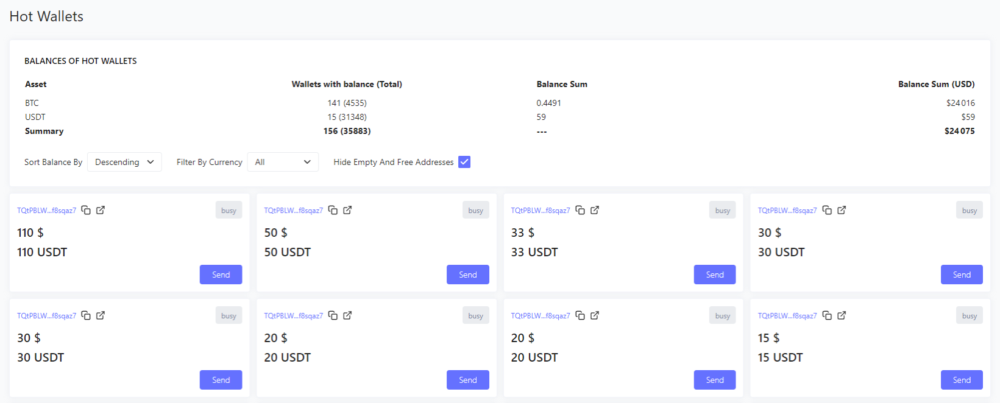
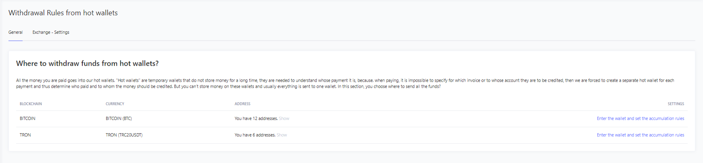

# Как пользоваться Личным кабинетом

#### Рабочий стол.

Это пространство, в котором содержится Общая и сводная информация по вашему аккаунту.

Здесь можно отследить:
- Общий баланс по Горячим кошелькам в BTC/TRON;
- Мониторинг системы и наличие ошибок;
- Процессинговый баланс и актуальное количество ресурсов;
- Экономию и Обмен при сжигании Energy и Bandwidth;
- Сводку по Депозитам в разрезе суток;
- Транзакции пополнения по Горячим кошелькам.

Для максимально эффективного способа вывода ресурсов необходимо использовать такой метод как - Stake.  
На данный момент актуальным способом является  Stake 2.0

При таком раскладе владелец Магазина будет существенно экономить на комиссиях за переводы токенов с Горячих кошельков на Личные Кошельки/ Биржевые кошельки.  
При помощи метода Stake - пользователь ежедневно накапливает Energy и Bandwidth “заморозив” свои TRX, благодаря этому при переводе сумм с кошелька на кошелек можно будет сжечь Энергию и сэкономить на комиссии.  
Рекомендуем использовать для стейкинга TronLink.

#### Процессинговый кошелек.

Вы можете использовать как Наш Процессинговый кошелек, так и свой, который Мы подключим к вашему кабинету.  
Для этого лучшим решением будет связаться с Вашим персональным менеджером, либо связаться с Support   
Мы передадим: Кошелек, Мнемоник фразу и Вы сможете пользоваться TronLink для “заморозки” TRX

Для вывода средств с Горячего кошелька на Личные Кошельки/ Биржевые кошельки используется несколько методово:

- Delegate - это метод, при котором было “застейкано” некоторое количество TRX, и полученные Energy и Bandwidth тратятся на оплату комиссий для переводов с Горячего кошелька - на Ваш кошелек вывода(это может быть Ваш Холодный кошелек, либо кошелек Биржи)

- Regular - это метод, при котором для оплаты комиссий необходимо будет сжигать TRX.

#### Ваши проекты.

В этом разделе, Вы можете создавать Магазины, мониторить количество платежей, их сумму и изменять настройки для каждого из них.

В разделе “Настройки” Вам доступно редактирование:

- Срока действия инвойса;
- Время заморозки для адреса инвойса;
- Активация фактического курса при оплате;
- Редактирование Статуса магазина;
- Возможность использовать Постоянные адреса для оплаты.

В расширенных настройках, Вы можете настраивать API ключи, управлять Webhook и возможностью использовать URL возврата при совершении оплаты по инвойсу

#### Горячие кошельки.

Для оплаты услуг на вашем Мерчант создается отдельный Горячий кошелек для каждого пользователя, который находится во вкладке Горячие кошельки:
Вы сможете просмотреть историю транзакций по каждому кошельку, который был задействован для оплаты.

Для активации Горячих кошельков необходимо иметь на балансе не менее 1 TRX, поэтому лучшим решением будет держать некоторую сумму на счету Процессингового кошелька для их активации.

#### Правила вывода.
Этот раздел используется для вывода средств с Горячих кошельков - на Ваш холодный кошелек, либо же Биржевой счет.

В разделе Правила вывода, Вы можете указать Ваши кошельки, на которые будут переведены все полученные средства. Внутри каждого кошелька в системах BTC/TRON есть возможность выбора метода пересылки средств, такие как:
- Пересылать сразу как поступили средства;
- Пересылать в ручную;
- Пересылать по накоплению опред. суммы;
- Пересылать по расписанию.

 Для вывода средств с Горячих кошельков на Ваш холодный кошелек, либо же Биржевой счет, необходимо выполнить следующие пункты:

1. Пополнить процессинговый кошелек TRX и застейкать их, для получения Energy и Bandwidth (подробнее в пункте **Рабочий стол**)

2. Выбрать метод Delegate/Regular для совершения транзакций по переводу (подробнее в пункте **Процессинговый кошелек**)

3. Указать кошельки BTC/TRON и способ вывода на них средств ( подробнее в пункте **Правила вывода**)

После выполнения вышеописанных пунктов, у Вас не должно остаться вопросов о выводе средств.

