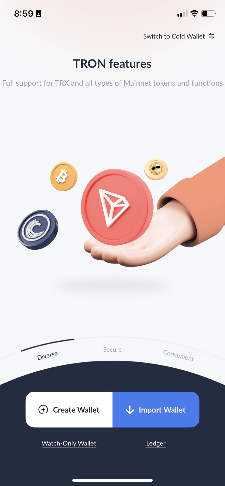
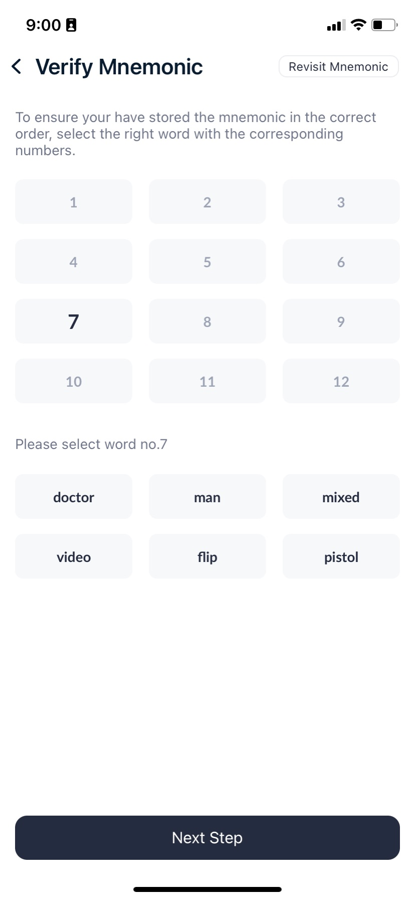
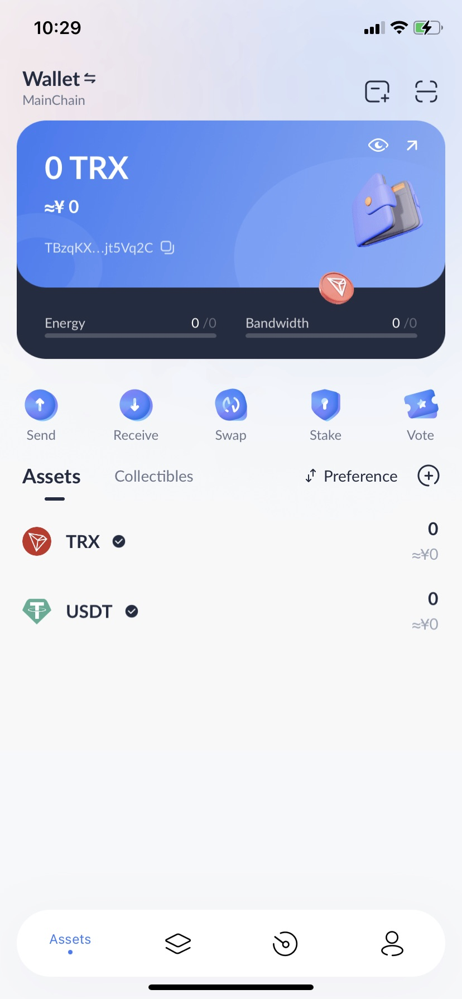
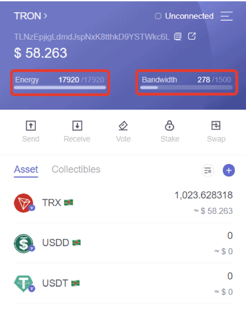

# Как заморозить токены TRX для получения бесплатных Bandwidth и Energy

*Команда DV.NET рекомендует использовать TronLink для стейкинга монеты TRX.*

В чем преимущество TronLink?
Не каждый мобильный кошелек корректно поддерживает сеть TRON.

Решение TronLink создаёт максимальные удобства для использования криптовалюты и её токенов TRC.  
 Вы можете использовать TronLink на своих смартфонах ANDROID/IOS, в браузерах CHROME/FIREFOX

 Для чего это нужно?
- При помощи метода Stake - пользователь ежедневно накапливает Energy и Bandwidth “заморозив” свои TRX, благодаря этому при переводе сумм с кошелька на кошелек можно будет сжечь Энергию и сэкономить на комиссии.

Таким образом Вы экономите свои средства на Трансферах и сможете максимально быстро  активировать “Горячие кошельки” для своих покупателей.

 **1-й шаг:** При первом запуске кошелька нужно создать новый, или вставить существующий сид.
Нажмем **«Create Account»**, прочитайте до конца лицензионное соглашение и подтвердите **«Accept»**.

 **2-й шаг:** Теперь придумайте имя **«Set Name»** (оно нигде не регистрируется и никак не связано с вашим аккаунтом, а нужно лишь для вашего удобства, чтобы различать кошельки, если вы создадите несколько в будущем).
Подтверждаем **«Next Step»**.

 **3-й шаг:** Задайте пароль, как минимум с 1 маленькой, 1 большой буквой, 1 цифрой и длиной не менее 8 символов. И введите его повторно для подтверждения.

Самый главный шаг – мнемоническая фраза. Это будет единственный способ восстановить TronLink кошелёк, если вы потеряете устройство или удалите приложение. Подтверждаем **«Back up now»**.

 **4-й шаг:** После успешного сохранения бэкапа входим на страницу приветствия кошелька TronLink.  
*Здесь вкладки **«Assets»** (Активы), **«Market»** (Биржа, обмен монет), **«Browser»** (Использование децентрализованных приложений, таких как Just) и **«My»** (Настройки кошелька).*

 **5-й шаг:** Чтобы «застейкать» монеты TRX, нужно совершить несколько действий:
1. В кошельке TronLink выбираем опцию **«Stake»**.
2. Нас переносит на страницу пополнения, где нужно выбрать **«получить»**.
3. В открывшемся окне делаем выбор в пользу **«TRON Power and Energy»**.
4. Вводим количество монет TRX, которые можно отправить на заморозку. У нас это будет 1000.
5. Соглашаемся и жмем кнопку **«Stake»**.
6. Операция будет завершена в течение 1 минуты.

 Готово, теперь у вас есть энергия для бесплатных транзакций. Наши замороженные 1000 TRX дали почти 18 000 единиц Energy.  
Попробуем осуществить еще один перевод.
Повторяем действия, описанные выше и вуаля – на этот раз за перевод 10 TRX на другой кошелек с нас взяли только Bandwidth,  
без сжигания токенов, как это было до стейкинга.

