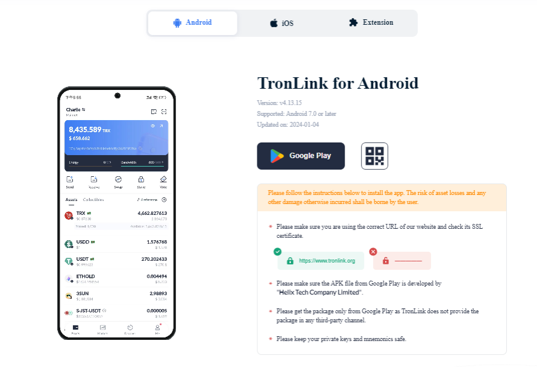
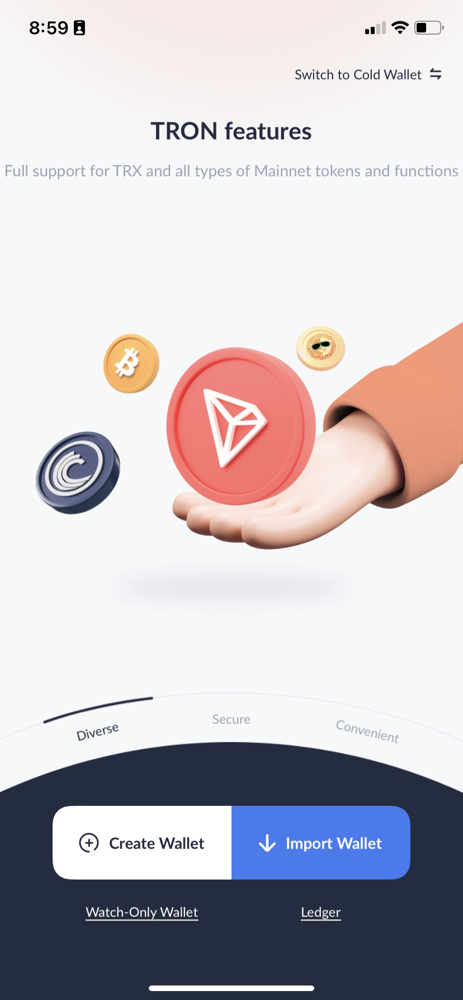
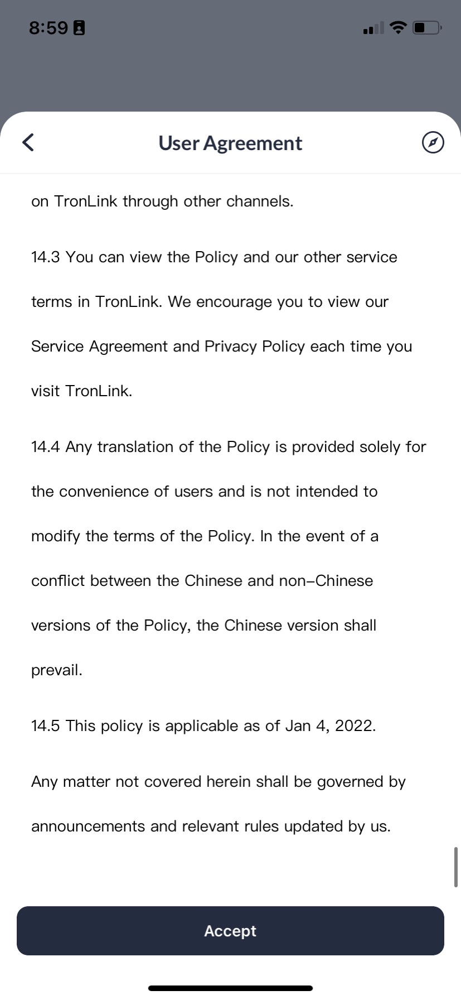
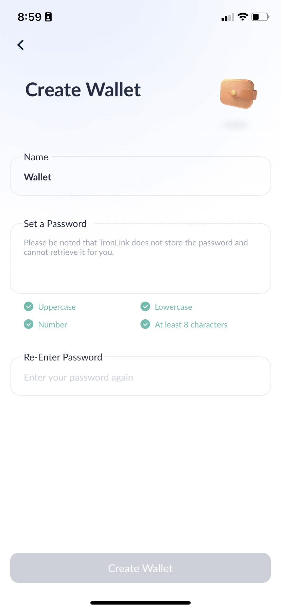
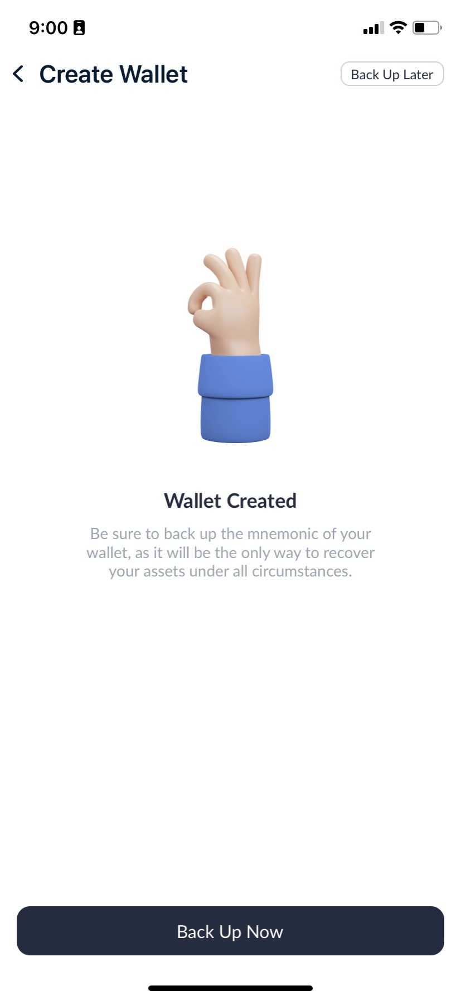
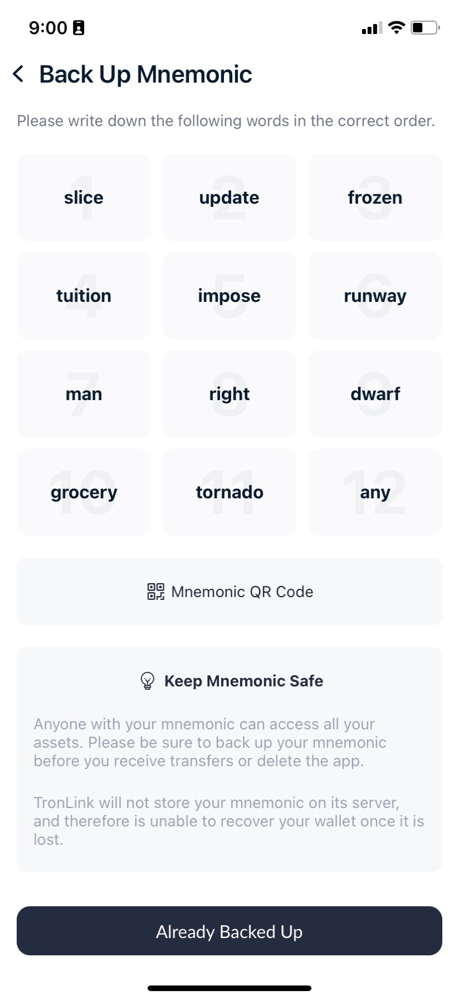
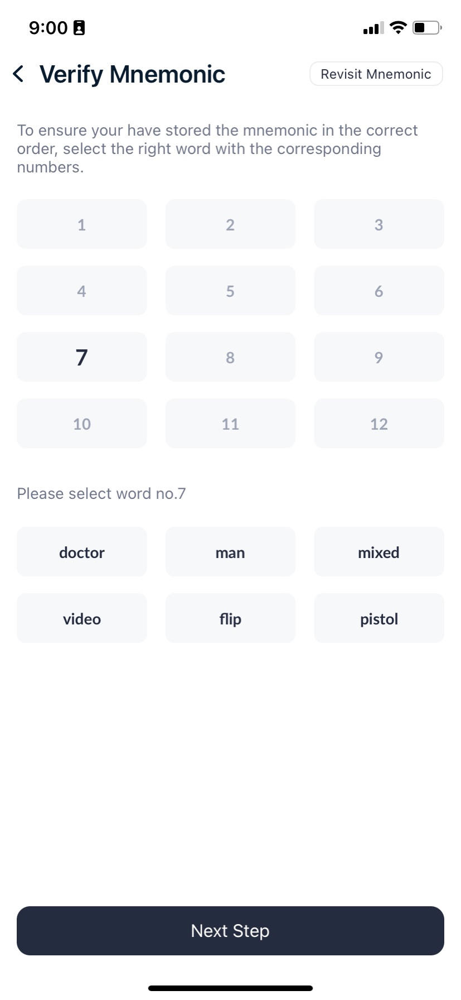
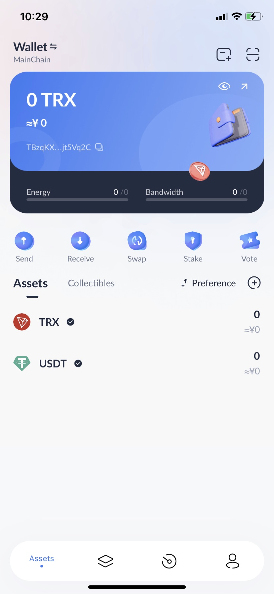
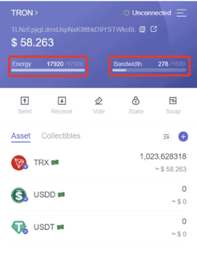

# How to freeze TRX Tokens to get Free Bandwidth and Energy

*DV.NET team recommends using TronLink to stake a TRX coin.*

What is the advantage of TronLink?  
Not every mobile wallet supports the TRON network correctly.

The TronLink solution creates maximum convenience to use cryptocurrency and its TRC tokens.

 You can use TronLink on your ANDROID/IOS smartphones, in CHROME/FIREFOX browsers

 What is it for?
- With the Stake method, the user accumulates Energy and Bandwidth daily by “freezing” their TRX, which allows them to burn Energy and save on commission when transferring amounts from a wallet to a wallet.

 This way you save your money on Transactions and will be able to activate 'Hot Wallets' for your customers as quickly as possible.

 **Step 1:** When you first launch the wallet, you need to create a new seed, or insert an existing one.
Click **'Create Account'**, read the license agreement and confirm by clicking **'Accept'**.

 **Step 2:** Now create the name of your wallet **'Set Name'** (it is not registered anywhere and not connected with your account, this is only for your convenience in order to distinguish wallets if you create several in the future).  
Then confirm by clicking **"Next Step"**.

 **Step 3:** Set a password. It must include at least 1 lowercase letter, 1 capital letter, 1 digit and be at least 8 characters long. Then enter the password again to confirm.

The most important step is the mnemonic phrase. This will be the only way to recover your TronLink wallet if you lose your device or delete the app.  
Then click **"Back up now"** to confirm.

 **Step 4:** After the successful backup, go to the TronLink wallet Welcome page.  
*Here we can find such tabs as **'Assets'**, **'Market'** (Stock exchange, Coin exchange), **'Browser'** (decentralized applications such as **'Just'**) and **'My'** (Wallet settings).*

 **Step 5:** To 'stake' TRX coins, you need to perform the following actions:

1. Select the 'Stake' option in the TronLink wallet.
2. Now we are taken to the replenishment page, where you need to select 'receive'.
3. In the pop up window, we chose "TRON Power and Energy".
4. Enter the number of TRX coins that can be frozen. In our case it is 1000.
5. Agree by clicking  'Stake'.
6. The operation will be completed within 1 minute.

 That's it, now you have Energy for free transactions. Our 1000 frozen TRX yielded almost 18,000 units of Energy.  
Let's try to make one more transaction.
We repeat the steps described above and voila - this time we have been charged only Bandwidth for the transaction of 10 TRX to another wallet, without burning tokens, as it was before staking.

